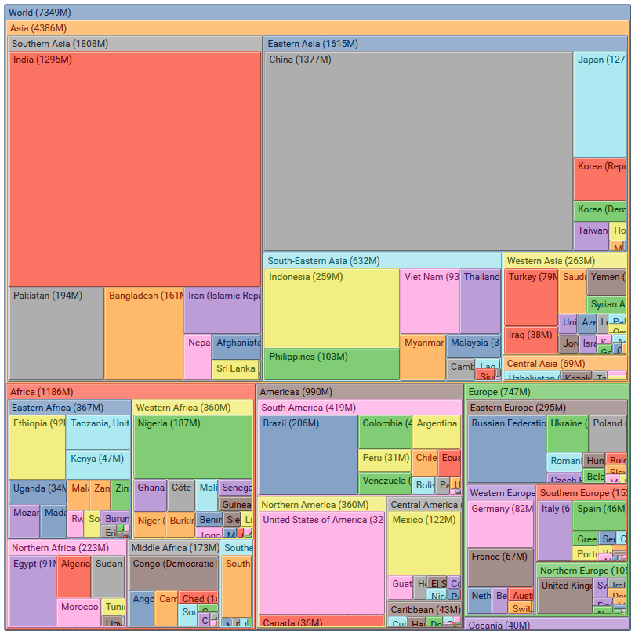

# treemap-multilevel

Multilevel treemap component created with [`D3`](https://d3js.org/) and [`React`](https://facebook.github.io/react/)

Example
-------

This is how component looks like displaying world countries populations on treemap.

How to use
----------

See [`src/demo`](src/demo).
